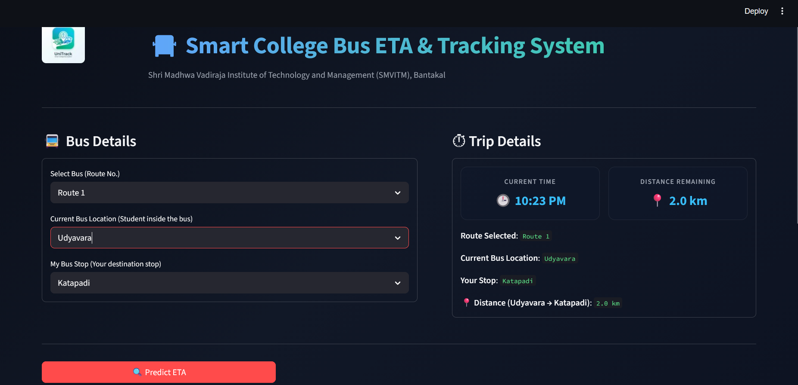
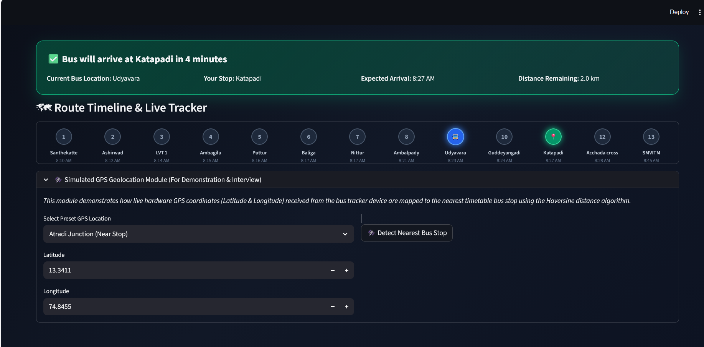

# 🚌 SMVITM Bus Tracker

An interactive bus route management application developed to help students and staff quickly access transportation information for **Shri Madhwa Vadiraja Institute of Technology and Management (SMVITM)**.

The application processes bus route data, provides route lookup functionality, and presents information through an intuitive dashboard to improve the accessibility of campus transportation details.

---

## Overview

Managing campus transportation information manually can be inconvenient for students and staff. This project provides a centralized interface for viewing bus routes and related information, making it easier to find transportation details quickly.

---

## Features

* Interactive dashboard
* Bus route lookup
* Route information management
* Excel-based data processing
* Fast search functionality
* Simple and user-friendly interface
* Modular Python codebase

---

## Technology Stack

| Category        | Technology      |
| --------------- | --------------- |
| Language        | Python          |
| Data Processing | Pandas          |
| Excel Handling  | OpenPyXL        |
| Dashboard       | Dash / Plotly   |
| Data Source     | Microsoft Excel |

---

## Project Structure

```text
SMVITM_Bus_Tracker/
│
├── assets/
│   └── logo.png
│
├── dashboard.py
├── routes.py
├── utils.py
├── process_user_data.py
├── init_project.py
├── verify_project.py
│
├── requirements.txt
├── README.md
└── SMVITM_BUS_DATASETS.xlsx
```

---

## Installation

### Clone the repository

```bash
git clone https://github.com/Poornima18090303/SMVITM_Bus_Tracker.git
```

### Navigate to the project

```bash
cd SMVITM_Bus_Tracker
```

### Install dependencies

```bash
pip install -r requirements.txt
```

### Run the application

```bash
python dashboard.py
```

---

## Usage

1. Launch the application.
2. Open the local URL displayed in the terminal.
3. Browse available bus routes.
4. Search for a specific route or destination.
5. View route information through the interactive dashboard.

---

## Screenshots

### Home Dashboard

*A screenshot of the application's main page.*

<!-- Replace the image below after adding your screenshot -->



---

### Route Details

*Displays detailed information about the selected bus route.*



---

### Dataset

The project uses an Excel dataset (`SMVITM_BUS_DATASETS.xlsx`) containing bus routes and transportation information required by the application.

---

## Future Improvements

* Live GPS tracking
* Real-time bus location updates
* ETA prediction
* Mobile application support
* Admin management portal
* Database integration

---

## License

This project is intended for educational purposes.
